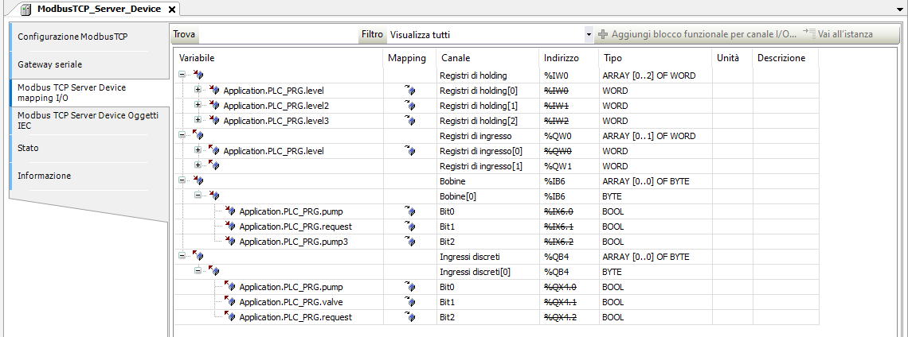
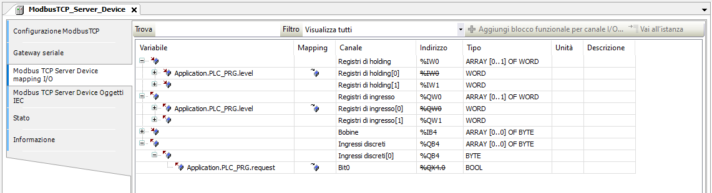
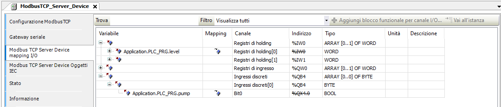
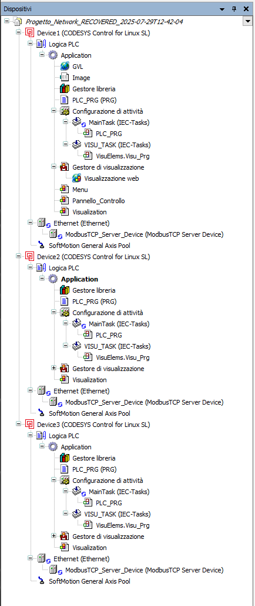
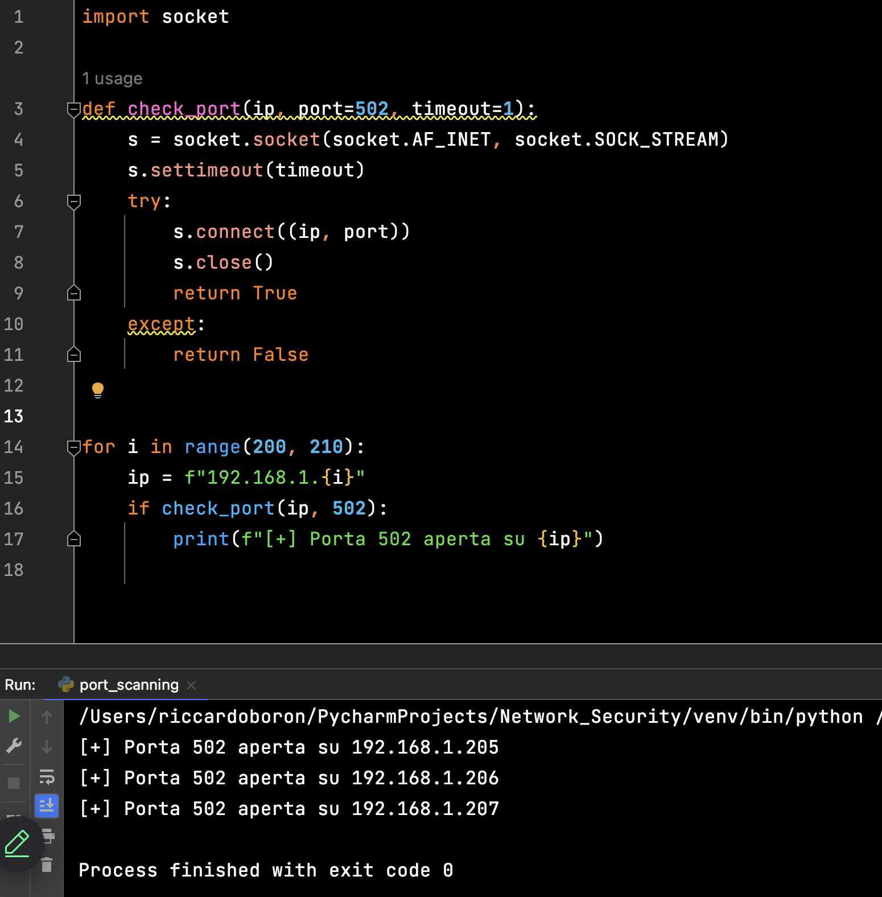
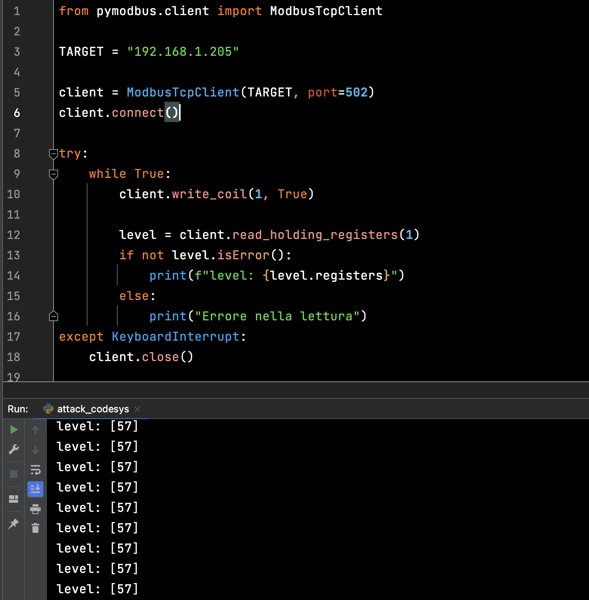
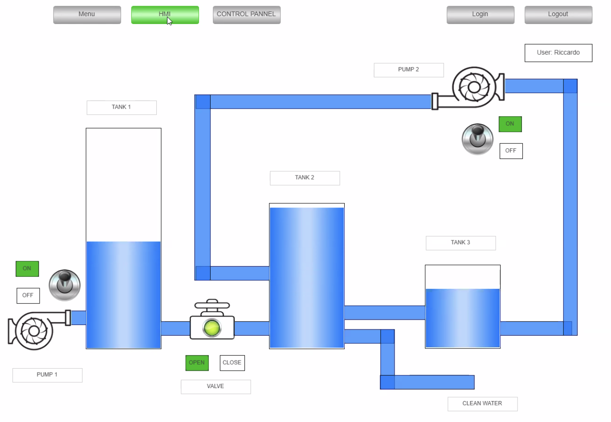
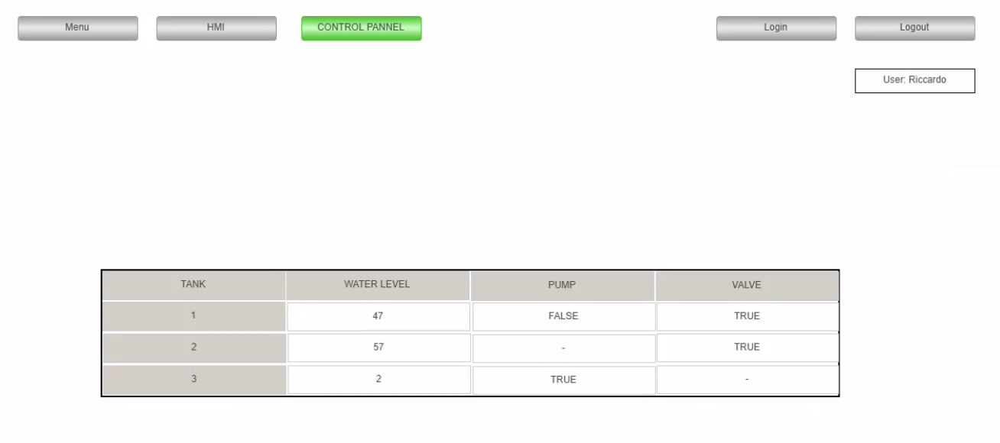
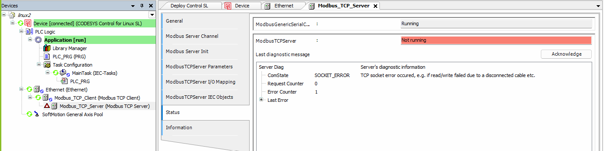

# Simplified Secure Water Treatment (SSWaT) system testbed with a Python physical process simulator

## Architettura del sistema
Lo scopo del progetto è quello di simulare un sistema di trattamento dell'acqua con CODESYS, usando 3 PLC, una per ogni vasca, e Modbus TCP per la comunicazione tra le varie PLC. 

**Figure 1**: Simplified SWaT system physical process


Ogni PLC viene eseguita su una macchina virtuale Ubuntu Server. Un processo python si occupa dell'interazione tra PLC1 e PLC2 utilizzando Modbus TCP, mentre un altro processo pyhton si occupa del processo fisico sempre con Modbus TCP, responsabile della lettura dei dati dei vari PLC e della modifica dei livelli dell'acqua. L'HMI è stato implementato nel PLC1 per non avere una quarta VM che occupasse troppe risorse (si può tranquillamente fare se si hanno risorse adeguate). Sfruttando il processo fisico risuciamo a ricavare i valori delle variabili del PLC2 e PLC3 e rappresentarli nell'HMI.

**Figure 2**: Architettura del sistema

Come si puó vedere nell´immagine (scansione della rete tramite Wireshark), la comunicazione avviene tramite modbus attraverso dei function code che indicano le scritture/letture dei vari registri del PLC.


## INFORMAZIONI PER REPLICARE IL PROGETTO
### Fase 1 - creazione PLC e run PLC 
Usando il pacchetto control linux SL, è necessaria una VM linux per ogni PLC. Si è deciso di usare delle VM linux server 24.04 molto leggere e basiche. 

Per scaricare la VM con il pacchetto codesys già installato: https://drive.google.com/drive/folders/1c7P_QSMdfO-VPcBIuDba0UIoW_2kgzTC?usp=sharing -> cartella VM (per accedere alla VM utilizzare le seguenti credenziali -> *username: user*, *password: user*).

Per scaricare la VM standard e quindi aggiungere il pacchetto come da tutorial: https://ubuntu.com/download/server e quando si fa l'installazione, configurare correttamente l'ssh. 
# 
### NOTA (Solo in caso si scarichi la VM con codesys già installato): 
Quando si scarica la VM bisogna resettare i file delle password dei device codesys, per farlo bisogna seguire i seguenti passaggi:
  * Accendere la VM e collegarsi con ssh attraverso il comando: ssh nome_vm@ip_vm (in questo caso il nome della VM è *user*)
  * Navigare fino alla cartella root (esegure due volte *cd ..*, in quanto la macchina appena avviata si trova in /home/user), successivamente lanciare i seguenti comandi:
    
```sh
sudo rm /var/opt/codesys/.UserDatabase.csv
sudo rm /var/opt/codesys/.UserDatabase.csv_
sudo rm /var/opt/codesys/.GroupDatabase.csv
sudo rm /var/opt/codesys/.GroupDatabase.csv_
```
  * Una volta lanciati questi comandi è possibile eseguire il device su codesys impostando la nuova password.

Per maggiori informazioni seguire il seguente link: https://edatec.cn/docs/an/an17-codesys-user-login-credentials-lost-user-guide/#_2-application-guide.
#

Seguire questo tutorial https://www.youtube.com/watch?v=rj0dOhgnGjs e apportare le seguenti modifiche: 
- al posto di Update Linux, premere su Tools, quindi su Deploy Control SL
- scan con porta corretta (22, di ssh) e selezionare l'ip della VM (deve essere nella stessa rete del pc su cui gira codesys, quindi selezionare *scheda con bridge* nelle impostazioni di rete della VM)
- click su deployment e selezionare codesys control linux SL, quindi installare il pacchetto sulla VM desiderata

A questo punto il pacchetto codesys control linux SL è installato sulla VM su cui girerà il PLC. 
Per attivare le PLC, come prima cosa bisogna accendere la VM e collegarla alla rete privata del pc su cui gira CODESYS. Doppio click sul device, scan network e selezionare la VM corretta.


### Fase 2 - modbus TCP
Per ogni Device, aggiungere un device ethernet che contiene a sua volta un modbus TCP server device. Quest'ultimo funzionerà come slave. Per la parte di modbus TCP master, ci si è affidati a un codice python. 

Ogni dispositivo ethernet va settato correttamente: quindi doppio click sul dispositivo -> general -> browse network interface e selezionare l'interfaccia corrispondente alla VM. 


Ogni modbus TCP server device va settato correttamente: doppio click -> general e aggiungere le coils/discrete inputs desiderati; -> I/O mapping e collegare le variabili desiderate del PLC_PRG ai vari canali (fare doppio click nella colonna variable alla riga corrispondente). Inoltre ricordarsi di attivare la voce Enable1 sempre nella schermata del mapping dove c'è scritto "always uptade variables".


#### Settare i Server ModbusTCP

A questo punto bisogna mappare le variabile dei plc sui registri del server Modbus TCP in modo da poter leggere/scrivere le variabili dal processo fisico.
Come mappare le variabili sui registri:

 * **Holding Registers**: valore a 16 bit, utilizzato per scrivere dal Client al Server (si può sia leggere che scrivere) --> funzione write_single_register(), read_holdingregisters().
 * **Input Registers**: valore a 16 bit, utilizzato per leggere dal Server al Client --> funzione read_inputregisters().
 * **Coils/Bobine**: valore booleano, utilizzato per scrivere dal Client al Server --> funzione write_single_coil().
 * **Discrete Inputs**: valore booleano, utilizzato per leggere dal Server al Client --> funzione read_discreteinput().

Su codesys abbiamo quindi:

* PLC1:
  


* PLC2:
  


* PLC3:
  


#### Struttura del progetto:


### Fase 3 - login CODESYS e start
Per eseguire lo start, tasto destro su Application e poi login. Verrà visualizzata una schemata dove verranno chieste le credenziali che sono state inserite nella fase 1. 
Una volta inserite correttamente, la PLC sono in esecuzione. 


### Fase 4 - hmi e schermata di login
Per semplicità e per risparmiare dal punto di vista computazionale, la hmi è stata creata nel plc1. Da un punto di vista concettuale non cambia niente, però, creare un ulteriore plc con hmi ad hoc per la parte di visualizzazione. 

Seguire questo tutorial https://www.youtube.com/watch?v=MpVdaDrxpDc&t=169s e al posto di creare un user management inserendo manualmente gli utenti fare i seguenti passi: 
- doppio click su visualization manager -> user management -> create runtime based user management with default groups 
- doppio click su device -> user and groups -> attivare la sincronizzazione premendo la "rotellina" verde in alto a sinistra
- creare un gruppo Operator e aggiungere degli utenti a quel gruppo
- a questo punto si può proseguire con il tutorial e assegnare le possibili azioni ai vari bottoni basandosi sull'appartenenza a un gruppo

  

Doppio click su webvisu e assicurarsi che la prima pagina visualizzata sia Menu (eventualmente ridimensionare la dimensione della visualizzazione).

Runnare tutte le PLC e i codici python. A questo punto aprire il browser e digitare <*ip plc con hmi*>:8080/webvisu.htm


**Figure 1**: HMI

**Figure 2**: Control Panel


## Funzionamento del sistema
Visionare i video al seguente link nella cartella *Video*: https://drive.google.com/drive/folders/1JATZD6WBIS1a-mGmHA5qJ0BmNZkYnqBO?usp=sharing

### Video *CODESYS SETUP*
Il video illustra come effettuare il setup dei vari device per poter eseguire l'intero progetto. 

### Video *HMI*
Il video mostra come visualizzare l'hmi in esecuzione dopo aver fatto partire i vari script python (processo fisico e interazione tra plc). Viene eseguito l'accesso con l'utente Riccardo, amministratore, che in questo caso ha tutti i permessi e può quindi visualizzare l'hmi. 

### Video *CONTROL PANEL*
Il video dimostra come un utente senza permessi non possa visualizzare l'hmi e il pannello di controllo. In questo caso l'utente Alessia, operatore, non ha i permessi adeguati.  

## Simulazione attacco
Abbiamo provato a simulare un attacco al PLC2 con l'obiettivo di andare a riempire e far strabordare la vasca 2 nel processo fisico. 
L'attacco è stato condotto attraverso un altro PC, diverso da quello in cui i PLC erano in esecuzione, collegato alla stessa rete Wi-Fi.

L'attacco in sè prevede due importanti concetti:
1. L'HMI visulizza la vasca piena ma non che straborda (limite della visualizzazione grafica).
2. Il control panel invece mostra i valori alterati della vasca 2.

### Attacco: Fase 1
Nella prima fase si effettua una scansione della rete (con uno script Python) per verificare su quali indirizzi IP è aperta la porta 502 sulla quale avviene la comunicazione Modbus TCP.


### Attacco: Fase 2
Una volta intercettati gli IP corretti si procede modificando i livelli delle vasche, abbiamo scelto la vasca 2, settando a TRUE la valvola che fa passare l'acqua dalla vasca 1 alla vasca 2 (quindi la valvola rimane sempre aperta).


### Attacco: Risultato
Si può vedere che il livello della vasca è aumentato e nel control panel possiamo andare a visulizzare il valore effettivo. La vasca 2 ha una capacità massima di 30 litri, e con l'attacco il livello viene ampiamente superato (nell'immagine il valore è 57 litri).





### Considerazioni sull'Attacco:
1. L'attaccante deve avere accesso alla rete su cui viene eseguito Codesys.
2. L'attaccante deve essere a conoscenza di quali sono le variabili/il processo fisico in questione (questo è possibile capirlo effettuando un'analisi del traffico nella rete).
3. Nel nostro sistema non abbiamo dovuto bypassare firewall o crittografia in quando in ModbusTCP le informazioni viaggiano in chiaro.

## Limitazioni / scelte progettuali
### Macchine virtuali
Si è scelto di usare tre VM, una per ogni plc, e sfruttare una di queste plc per l'interfaccia grafica. Chiaramente si sarebbe potuta mettere una quarta VM che si occupasse solo di ricevere i dati e popolare un'hmi, ma questo avrebbe richiesto più risorse. 

### ModbusTCP
Per quanto riguarda la parte di interazione con ModbusTCP, sono stati riscontrati alcuni problemi con l'utilizzo del Client (master) Modbus integrato in codesys: seguendo questo video https://www.youtube.com/watch?v=P9Wvl8wJTNQ non avevamo la voce *Enable 2* e questo faceva si che si riscontrasse l'errore *Bus Not Running* rendendo impossibile la comunicazione. A fronte di questo problema, abbiamo deciso di creare un master direttamente in python utilizzando la libreria *easyModbus* e aggiungere un ModbusTCP server device (slave) per ogni plc.


### Processo fisico
Si è deciso di usare i litri (espressi in numero intero) come unità di misura dell'acqua e di mantenere un flusso costante dell'acqua. Il passaggio dell'acqua dalla valvola è sempre costante indipendentemente dalla quantità di acqua nella vasca e si articola nel seguente modo: 
* Pump1: 4 litri al secondo
* Valve: 2 litri al secondo (da tank1 a tank2)
* Tube tank2-tank3: 1 litro al secondo
* Clean water tube: 1 litro al secondo
* Pump2: 1 litro al secondo (da tank3 a tank2)


Livelli vasche: 
* Tank1: 100 litri (min 40, max 80)
* Tank2: 30 litri (min 10, max 20)
* Tank3: 4 litri (min 0, max 3)


