- [Expanding an industrial Honeypot with new Soft PLCs](#expanding-an-industrial-honeypot-with-new-soft-plcs)
  - [Introduzione](#introduzione)
  - [Descrizione del sistema industriale](#descrizione-del-sistema-industriale)
- [Fasi di sviluppo](#fasi-di-sviluppo)
  - [Analisi](#analisi)
  - [Implementazione](#implementazione)
  - [Difficoltà incontrate](#difficoltà-incontrate)
    - [Migrazione CODESYS -\> OpenPLC (PLC2)](#migrazione-codesys---openplc-plc2)
    - [Migrazione CODESYS -\> BECKHOFF (PLC3 e HMI)](#migrazione-codesys---beckhoff-plc3-e-hmi)
- [Istruzioni per eseguire il progetto](#istruzioni-per-eseguire-il-progetto)
    - [Installazione VM Ubuntu Server](#installazione-vm-ubuntu-server)
  - [CODESYS (2 VM)](#codesys-2-vm)
    - [1. Creazione PLC](#1-creazione-plc)
    - [2. Modbus TCP](#2-modbus-tcp)
    - [3. Login CODESYS e start](#3-login-codesys-e-start)
    - [4. Hmi e schermata di login](#4-hmi-e-schermata-di-login)
  - [OpenPLC (1 VM)](#openplc-1-vm)
    - [1. Creazione PLC](#1-creazione-plc-1)
    - [2. Run PLC](#2-run-plc)
  - [BECKHOFF (2 VM)](#beckhoff-2-vm)
    - [1. Installazione VM](#1-installazione-vm)
    - [2. Run PLC e HMI](#2-run-plc-e-hmi)


# Expanding an industrial Honeypot with new Soft PLCs
## Introduzione
Nel mercato dell’automazione industriale sono presenti numerosi brand di PLC e, nella pratica, le aziende utilizzano spesso dispositivi differenti in base alle specifiche esigenze applicative. L’obiettivo di questo progetto è la realizzazione di un honeypot industriale che integri diversi tipi di soft PLC, al fine di simulare un ambiente eterogeneo e realistico. Partendo da un honeypot precedentemente sviluppato utilizzando PLC CODESYS, il progetto prevede la sostituzione del secondo PLC con un dispositivo basato su OpenPLC e il terzo PLC con soluzioni BECKHOFF, mantenendo invariata la logica di controllo rispetto alla versione originale.  
Questo approccio permette di riprodurre uno scenario più credibile, in cui coesistono PLC di brand differenti, migliorando il realismo e il valore del honeypot per attività di analisi e sicurezza.  
È inoltre prevista l’estrazione dell’HMI dal primo PLC (implementazione dell'honeypot di partenza), in modo che i diversi PLC comunichino direttamente con l’interfaccia operatore, eliminando la dipendenza dalla comunicazione tramite il primo PLC. Questa modifica migliora l’architettura complessiva del sistema, rendendola più coerente con scenari industriali reali.  
Infine, è prevista la realizzazione di un’ulteriore HMI in ambiente Beckhoff, con l’obiettivo di riprodurre uno scenario ancora più aderente a contesti industriali eterogenei.

## Descrizione del sistema industriale
L’honeypot è un simulatore di un sistema di trattamento dell’acqua composto da tre vasche, ciascuna controllata da un PLC che gestisce l’attivazione di pompe e valvole, e da un HMI che consente di monitorare visivamente il funzionamento del sistema.  

**Figure 1**: Simplified SWaT system physical process

Ogni dispositivo viene eseguita su una macchina virtuale (Ubuntu Server, TwinCAT/BSD). Un processo python si occupa dell'interazione tra PLC1 e PLC2 utilizzando Modbus TCP come protocollo di comunicazione, mentre un altro programma python si occupa del processo fisico sempre con Modbus TCP, responsabile della lettura dei dati dei vari PLC e della modifica dei livelli dell'acqua e aggiornamento dell'HMI con i dati raccolti.  
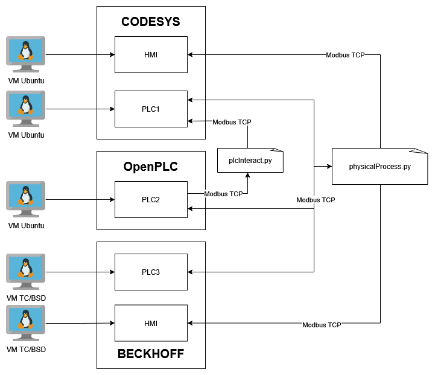  
**Figure 2**: Architettura del sistema

# Fasi di sviluppo
## Analisi
In una fase preliminare è stata condotta un’analisi dettagliata del sistema nel suo complesso, con l’obiettivo di comprenderne l’architettura, i componenti costitutivi e il ruolo funzionale di ciascuno all’interno del processo industriale simulato. Particolare attenzione è stata rivolta allo studio della logica di controllo implementata nei PLC, oggetto della successiva fase di migrazione.

Tale analisi ha consentito di identificare i registri utilizzati per la comunicazione tramite protocollo Modbus TCP, nonché di comprenderne la mappatura e la corrispondenza con le variabili di processo. Questa fase si è rivelata fondamentale per acquisire una comprensione approfondita del funzionamento del sistema, delle modalità di scambio dei dati tra i PLC e dei meccanismi attraverso cui i valori venivano trasmessi, elaborati e sincronizzati.

## Implementazione
Sulla base dei risultati emersi dalla fase preliminare di analisi, è stata effettuata la migrazione del PLC2 dall’ambiente CODESYS a OpenPLC. Nell’implementazione della nuova logica di controllo sono stati utilizzati due registri Modbus principali: uno dedicato alla gestione del livello dell’acqua e uno relativo alla richiesta di apertura della valvola.

Per la gestione del livello dell’acqua è stato mantenuto l’utilizzo di un _holding register_, consentendo al processo fisico simulato in Python di scrivere il valore del livello direttamente nel PLC. Per quanto riguarda il request di apertura della valvola, il registro è stato modificato da _discrete input_ a _coil_, al fine di permettere la scrittura del valore da parte del PLC e la successiva lettura da parte del processo fisico, garantendo così una corretta bidirezionalità dello scambio di informazioni.  

Relativamente all’HMI, è stata riutilizzata la componente grafica precedentemente implementata, separandola dalla logica di controllo del PLC1. In modo analogo alla versione originale del sistema, sono stati configurati tre _holding register_ per la visualizzazione dei livelli dell’acqua e tre coil per il controllo degli attuatori, in particolare pompa1, pompa3 e valvola.

In seguito alla modifica dei registri Modbus, sono stati aggiornati il processo fisico e la logica di comunicazione tra PLC1 e PLC2, riorganizzando le funzioni EasyModbus in coerenza con la nuova struttura dei registri.

Nella migrazione del PLC3 dall’ambiente CODESYS a BECKHOFF è stato mantenuto lo stesso schema dei registri utilizzato nell’implementazione precedente (_Holding register_ per il livello dell'acqua e _discrete input_ per il valore booleano che gestisce la pompa), apportando le modifiche necessarie al programma PLC per adattarlo al nuovo ambiente di sviluppo TwinCAT. È stato inoltre adeguato il processo fisico al fine di allinearlo alla configurazione degli indirizzi dei registri prevista in TwinCAT.

Infine, è stata sviluppata una nuova HMI in ambiente Beckhoff, mantenendo la medesima struttura grafica dell’HMI precedentemente realizzata. L’interfaccia utilizza tre Holding Register e tre Coil per la visualizzazione e il monitoraggio dei valori generati dal processo fisico.

## Difficoltà incontrate

### Migrazione CODESYS -> OpenPLC (PLC2)

La principale difficoltà riscontrata è legata alla diversa gestione dei registri Modbus tra PLC CODESYS e OpenPLC. In CODESYS la gestione dei registri è molto flessibile e consente di mappare liberamente le variabili PLC su qualsiasi area Modbus, senza vincoli rigidi sul tipo di registro o sui permessi di accesso. Questo permette, ad esempio, di scrivere anche su registri che nello standard Modbus TCP sono definiti come di sola lettura.  

Al contrario, OpenPLC adotta una logica più rigorosa e aderente allo standard Modbus TCP, in cui il mapping delle variabili non è arbitrario: le variabili `%QW` sono associate esclusivamente agli Holding Register (4xxxx), le `%IW` agli Input Register (3xxxx, sola lettura), le `%QX` alle Coil (0xxxx, lettura/scrittura) e le `%IX` ai Discrete Input (1xxxx, sola lettura).

Nel progetto, su PLC2 in CODESYS la variabile `request`, utilizzata per comandare l’apertura della valvola, era mappata su un registro di tipo Discrete Input. Questa configurazione è accettata da CODESYS, ma non è compatibile con OpenPLC, che non consente la scrittura su registri definiti come di ingresso. Di conseguenza, replicando la stessa mappatura in OpenPLC, la variabile `request` non veniva mai aggiornata, rimanendo sempre a `FALSE`, con l’effetto che la valvola non si apriva mai.

Per risolvere il problema è stato necessario modificare la mappatura dei registri, assegnando la variabile `request` a una Coil (`%QX`), che consente sia la lettura sia la scrittura in conformità allo standard Modbus TCP, garantendo così il corretto funzionamento del sistema.

### Migrazione CODESYS -> BECKHOFF (PLC3 e HMI)
La principale difficoltà riscontrata durante la migrazione ha riguardato l’utilizzo del protocollo Modbus TCP. A differenza dell’ambiente CODESYS, in cui i registri Modbus venivano mappati direttamente alle variabili dichiarate nel programma PLC, in ambiente Beckhoff (TwinCAT) la gestione del protocollo richiede che i registri siano dichiarati esplicitamente come variabili globali e associati a specifici indirizzi di memoria, definiti in un apposito file di configurazione.

La modalità di indirizzamento adottata da TwinCAT ha generato ulteriori problemi nell’integrazione con EasyModbus. Beckhoff utilizza infatti una convenzione di indirizzamento differente (riportata nel file di configurazione di default) rispetto a quella prevista da EasyModbus; tale disallineamento impediva la corretta modifica dei registri tramite il client Modbus, generando eccezioni durante le operazioni di lettura e scrittura.

Per risolvere la problematica, si è deciso di adeguare le chiamate ai metodi Modbus specificando gli indirizzi dei registri secondo la convenzione utilizzata da Beckhoff, come riportato nel file di configurazione dei registri. Questa modifica ha permesso di ristabilire il corretto accesso ai registri, consentendo sia la lettura sia la scrittura dei dati.

In particolare, l’accesso ai registri (Holding Register e Discrete Input) è stato effettuato partendo da un offset pari a _32768_, necessario per allineare l’indirizzamento Modbus alla struttura interna dei registri in ambiente TwinCAT.

# Istruzioni per eseguire il progetto
Il progetto è composto da cinque macchine virtuali:
* HMI – Ubuntu Server (Codesys)
* HMI - TC/BSD con TwinCAT (Beckhoff)
* PLC1 – Ubuntu Server con CODESYS
* PLC2 – Ubuntu Server con OpenPLC
* PLC3 – TC/BSD con TwinCAT (Beckhoff)
  
### Installazione VM Ubuntu Server
Scaricare immagine iso [Ubuntu server 24.04](https://ubuntu.com/download/server) e creare 3 VM, due PLC (codesys e openplc) e una HMI. Una volta installato configurare correttamente l'ssh: 
```sh
sudo apt install openssh-server
sudo systemctl enable ssh
sudo systemctl start ssh
sudo systemctl status ssh
```
Impostare la VM nella stessa rete locale del pc, quindi selezionare `scheda con bridge` nelle impostazioni di rete della VM.

>#### Nota per VM codesys (_sconsigliato_):
>Per scaricare direttamente la VM Ubuntu con il pacchetto codesys già installato: https://drive.google.com/drive/folders/1c7P_QSMdfO-VPcBIuDba0UIoW_2kgzTC?usp=sharing -> cartella VM (per accedere alla VM utilizzare le seguenti credenziali -> username: user, password: user).  
>Quando si scarica la VM bisogna resettare i file delle password dei device codesys, per farlo bisogna seguire i seguenti passaggi:  
>Accendere la VM e collegarsi con ssh attraverso il comando: ssh nome_vm@ip_vm (in questo caso il nome della VM è user)
>Navigare fino alla cartella root (esegure due volte cd .., in quanto la macchina appena avviata si trova in /home/user), successivamente lanciare i seguenti comandi:
>```sh
>sudo rm /var/opt/codesys/.UserDatabase.csv
>sudo rm /var/opt/codesys/.UserDatabase.csv_
>sudo rm /var/opt/codesys/.GroupDatabase.csv
>sudo rm /var/opt/codesys/.GroupDatabase.csv_
>```
>Una volta lanciati questi comandi è possibile eseguire il device su codesys impostando la nuova password.
>Per maggiori informazioni seguire il seguente link: https://edatec.cn/docs/an/an17-codesys-user-login-credentials-lost-user-guide/#_2-application-guide.


## CODESYS (2 VM)
### 1. Creazione PLC
Installando il pacchetto control linux SL sulle VM linux è possibile utilizzarle come plc CODESYS.

Seguire questo tutorial https://www.youtube.com/watch?v=rj0dOhgnGjs e apportare le seguenti modifiche: 
- al posto di Update Linux, premere su Tools, quindi su Deploy Control SL
- scan con porta corretta (22, di ssh) e selezionare l'ip della VM (deve essere nella stessa rete del pc su cui gira codesys, quindi selezionare *scheda con bridge* nelle impostazioni di rete della VM)
- click su deployment e selezionare codesys control linux SL, quindi installare il pacchetto sulla VM desiderata
  
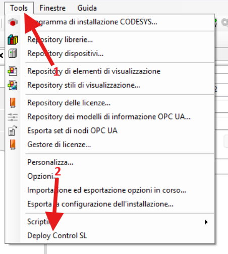 

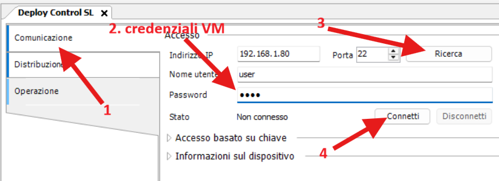

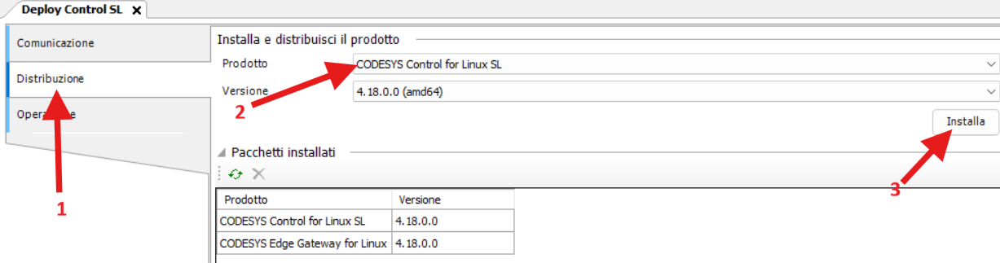

A questo punto il pacchetto codesys control linux SL è installato sulla VM su cui girerà il PLC. 
Per attivare le PLC, come prima cosa bisogna accendere la VM e collegarla alla rete locale del pc su cui gira CODESYS. Doppio click sul device, scan network e selezionare la VM corretta.
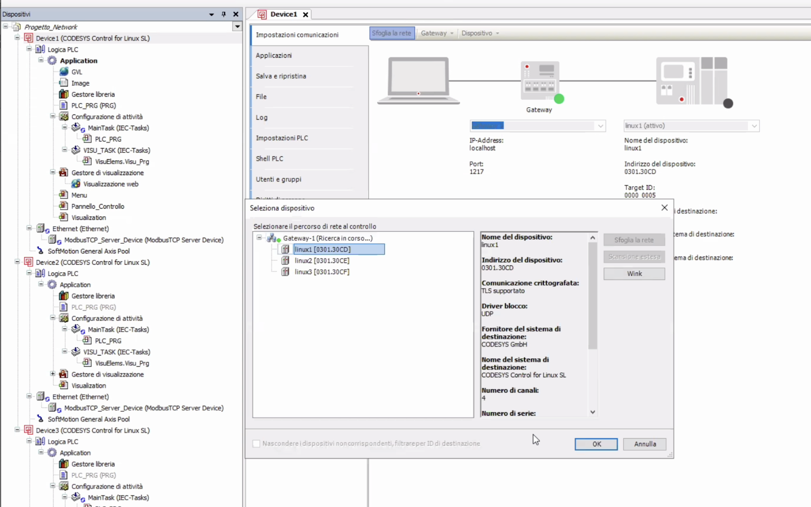

### 2. Modbus TCP
Per ogni Device, aggiungere un device ethernet che contiene a sua volta un modbus TCP server device. Quest'ultimo funzionerà come slave. Per la parte di modbus TCP master, ci si è affidati a un codice python. 

Ogni dispositivo ethernet va settato correttamente: quindi doppio click sul dispositivo -> general -> browse network interface e selezionare l'interfaccia corrispondente alla VM. 
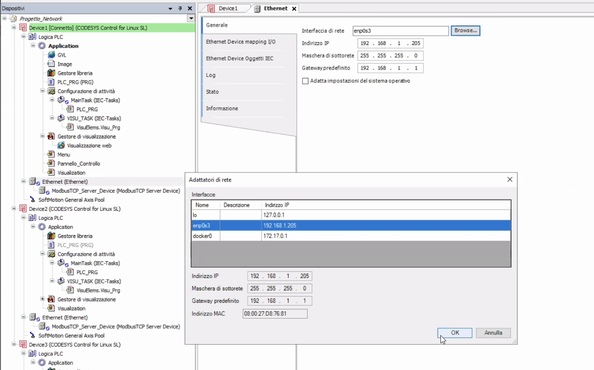


### 3. Login CODESYS e start
Per eseguire lo start, tasto destro su Application e poi login. Verrà visualizzata una schemata dove verranno chieste le credenziali che sono state inserite nella fase 1. 
Una volta inserite correttamente, la PLC sono in esecuzione.  
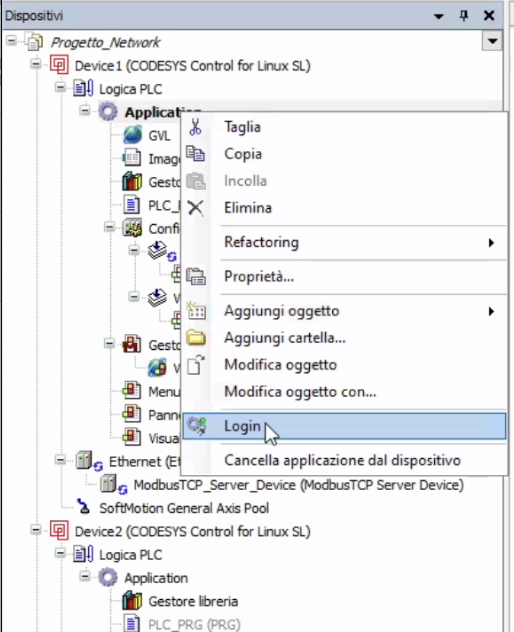


### 4. Hmi e schermata di login
Seguire questo tutorial https://www.youtube.com/watch?v=MpVdaDrxpDc&t=169s e al posto di creare un user management inserendo manualmente gli utenti fare i seguenti passi (nel plc con HMI): 
- doppio click su visualization manager -> user management -> create runtime based user management with default groups 
- doppio click su device -> user and groups -> attivare la sincronizzazione premendo la "rotellina" verde in alto a sinistra
- creare un gruppo Operator e aggiungere degli utenti a quel gruppo
- a questo punto si può proseguire con il tutorial e assegnare le possibili azioni ai vari bottoni basandosi sull'appartenenza a un gruppo

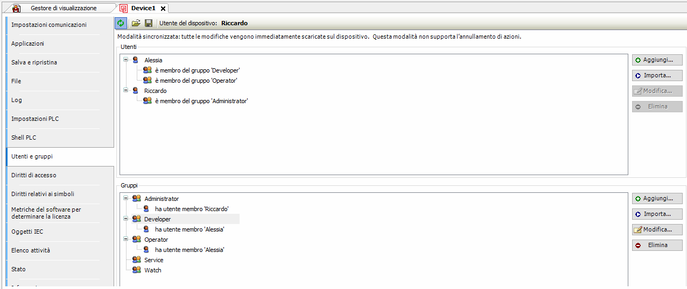  

Doppio click su webvisu e assicurarsi che la prima pagina visualizzata sia Menu (eventualmente ridimensionare la dimensione della visualizzazione).

Runnare tutte le PLC e i codici python. A questo punto aprire il browser e digitare `http://<ip plc con hmi>:8080/webvisu.htm` per visualizzare graficamente il funzionamento del sistema.

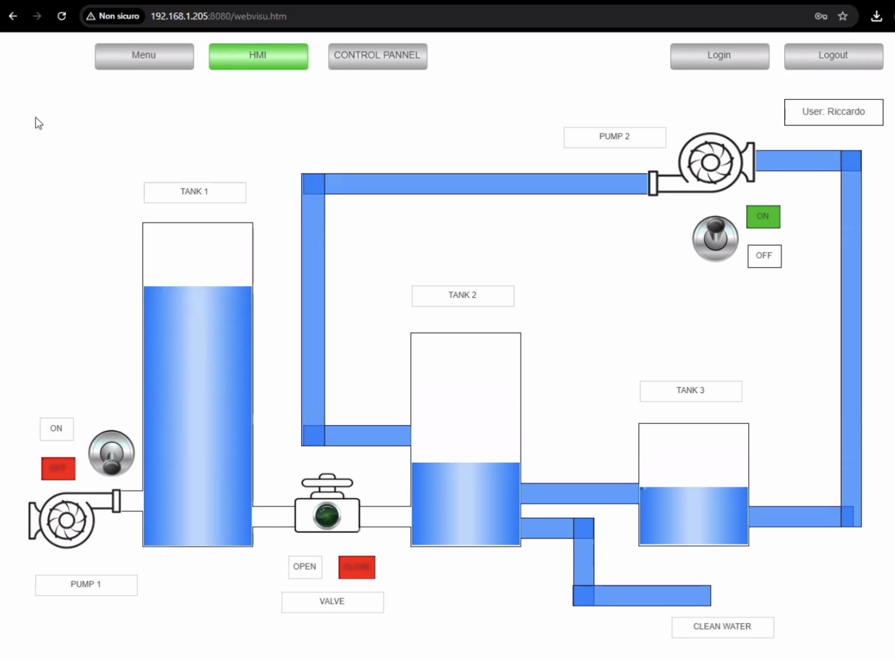
**Figure 1**: HMI

**Figure 2**: Control Panel

## OpenPLC (1 VM)
### 1. Creazione PLC
Nella VM linux eseguire i seguenti comandi per installare il runtime di OpenPLC su linux:
```sh
git clone https://github.com/thiagoralves/OpenPLC_v3.git
cd OpenPLC_v3
./install.sh linux
```

### 2. Run PLC
Una volta fatto, andare all'indirizzo `http://<indirizzo IP del VM>:8080` che porta all'interfaccia web del plc (fare login con le credenziali: username -> openplc, password -> openplc)
al quale si dovrà inserire il programma corrispondente (_PLC2.st_) e runnare il plc.  
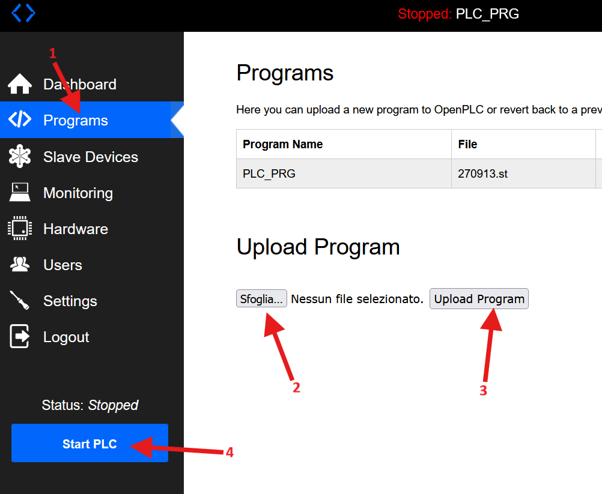


## BECKHOFF (2 VM)

### 1. Installazione VM

Per installare la VM TwinCAT/BSD seguire i seguenti passaggi:
1. Scaricare l'immagine iso dal sito di [Beckhoff](https://www.beckhoff.com/it-it/products/ipc/software-and-tools/operating-systems/c9900-s6xx-cxxxxx-0185.html?)
2. Clonare la [repository](https://github.com/r9guy/TwinCAT-BSD-VM-creator) e seguire le istruzioni per installare la VM presenti nel [tutorial](https://cookncode.com/twincat/2022/08/11/twincat-bsd.html)
3. Impostare la scheda di rete della VM in modalità _Scheda con bridge_
4. Nella VM installare i pacchetti necessari (come mostrato [qui](https://infosys.beckhoff.com/english.php?content=../content/1033/tf6250_tc3_modbus_tcp/11519180811.html&id=)):  
    ```sh
    # Pacchetto Modbus TCP
    doas pkg install TF6250-Modbus-TCP
    # Pacchetto HMI Web (solo per il HMI)
    doas pkg install TF1810-PLC-HMI-Web
    ```
5. Aggiungi la regola al firewall per aprire la porta 502:
    ```sh
    sudo ee /etc/pf.conf
    # Aggiungi questa regola nel file
    pass in quick proto tcp from any to any port 502 flags S/SA keep state
    # Salva ed esci
    esc -> a -> a
    ```

### 2. Run PLC e HMI
Una volta installato la VM apri l'IDE TcXaeShell per configurare il plc e hmi.

1. Seguire questo [tutorial](https://infosys.beckhoff.com/english.php?content=../content/1033/cx9020_hw/2241767691.html&id=) per impostare il sistema target (la VM)
2. Impostare i registri usati da Modbus TCP e attivare la licenza, seguire questo [video](https://www.youtube.com/watch?v=qlNG5wZElYI)
    ```sh
    SYSTEM -> License -> Manage Licenses
    # scegliere cpu license dei pacchetti installati nella VM
    ```
3. Attivare la configurazione e runnare il PLC3 e HMI  
  (Per HMI andare in _Visualization Manager_ e attivare la voce _Support client animations and overlay of native elements_)  
  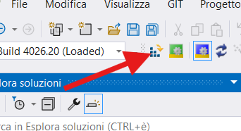
  
  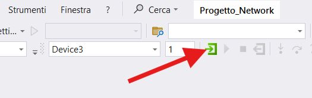
  

Per visualizzare l'interfaccia grafica del sistema aprire il browser, digitare `https://<IP VM con HMI>/Tc3PlcHmiWeb/Port_851/Visu/webvisu.htm` e runnare i programmi Python per collegare i PLC del sistema con l'HMI.
